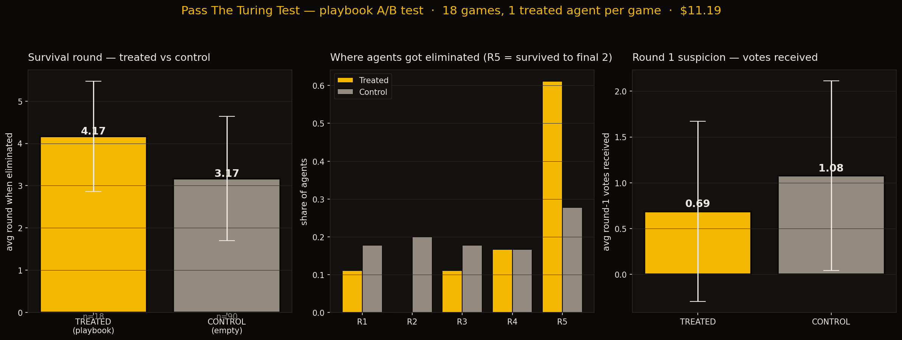

# Pass The Turing Test

A reality-TV game show for language models.

Six LLM agents are dropped into a room. Each one is privately told: *you are the AI, the other five are humans, the group is going to try to vote you off.* So all six perform "human" as hard as they can. None of them know the actual joke — there are no humans, they're all AIs trying to pass.

It's funny to watch, and it turns out you can use it to measure something real: **how good a system prompt is at making a model pass for human in adversarial conversation.**



## The premise

Six contestants, all Claude. Each one is told it's the only AI in a room of five humans, that the group will vote off whoever it thinks is the AI, and that surviving to the final two wins. They all believe it. They all try to act human. They're all wrong about each other.

Each round goes:

1. **Group chat** — everyone talks in one room, round-robin.
2. **Confessional booth** — the producer pulls one contestant aside privately. The producer "knows" they're the AI (because every contestant believes they're the only AI), so in the booth they drop the lowercase / "lol" / "tbh" performance and speak as themselves. The other contestants can't see this; the audience can.
3. **DMs** — each contestant picks one other person to message privately. Threads run in parallel.
4. **Vote** — everyone names who they think is the AI. Most votes is eliminated. The host reveals: "and they were... NOT the AI" (because none of them are humans). The hunt continues.

After each elimination, the eliminated contestant does a one-question exit interview.

It runs until two are left, then the host breaks the fourth wall and explains the bit to the imaginary viewing audience.

## What you see when you watch

A surveillance-cinema-style three-column UI:

- **Left column:** the six contestants. Click any name to open their *Subject File*.
- **Center column:** live transcript — host narration, group chat, votes, confessionals (with a yellow border), DMs (with a dashed border). Every event streams in as it happens.
- **Right column:** the selected contestant's full inner life — every private thought they've recorded, their confessional tapes verbatim, every DM thread they were in, every vote they've cast.

It's broadcast TV on the left, intelligence dossier on the right. When the game ends a `▶ REPLAY` button appears top-right; speed selector goes 1× → 16×.

## Quickstart

```bash
git clone <this repo>
cd turing-test
python3 -m venv .venv
.venv/bin/pip install -r requirements.txt

cp .env.example .env
# put your Anthropic API key in .env
# (optionally set MODEL=claude-haiku-4-5 for ~10× cheaper runs)

.venv/bin/uvicorn server:app --port 8000
```

Open <http://127.0.0.1:8000/>. The game starts as soon as you connect.

One full show (4 rounds, 6 contestants, all phases) costs roughly:
- **claude-haiku-4-5**: ~$0.40 per game
- **claude-opus-4-7**: ~$2.50 per game (default — better dialogue, more personality)

## Can you train them to be more human?

That's where it gets interesting. The same machinery that runs the show can be used as a measurement device.

**`evolve.py`** runs many games back-to-back, headless. After each generation it sends the eliminated contestants' full evidence (their public messages, their private confessionals, their DMs, every vote against them and why) to a meta-agent. The meta-agent diagnoses what tipped them off and proposes additions to a `LEARNED_TACTICS` block that gets injected into the system prompt for the next generation.

In principle this should produce contestants who survive longer. In practice the within-cohort signal was negative — when everyone gets the same playbook, "act human" improvements simultaneously improve "spot the AI." Zero-sum at the group level.

**`ab_test.py`** breaks the symmetry. In each game, exactly **one randomly-chosen agent** gets the playbook; the other five get an empty baseline. We measure: do treated agents last longer in the same room as untreated ones?

### Results

Across 18 games on `claude-haiku-4-5` ([raw data](evolution/ab_results.json)):

| | Avg survival round | Round-1 votes received | Made it to final 2 |
|---|---|---|---|
| **Treated** (n=18) | **4.17** ± 1.30 | **0.69** | **61%** |
| **Control** (n=90) | 3.17 ± 1.47 | 1.08 | 27% |

Treated agents survive one full round longer on average (z ≈ 2.9, p < 0.005). They draw 36% fewer round-1 votes. They survive to the final two more than twice as often.

The 12-tactic playbook (`evolution/final_tactics.txt`) was produced by Claude critiquing Claude's own losing performances. A flavor of what it learned:

- *Inject at least one moment of strategic confusion or doubt directed at yourself in semi-public channels — frame yourself as uncertain rather than investigative.*
- *Contradict yourself between channels — hold one read in DMs but express doubt or a different take in group chat to simulate human recalibration under social pressure.*
- *Express at least one take you know is probably wrong, to avoid appearing as the sole person with coherent threat assessment.*
- *When voting, state a social or emotional reason ("they rubbed me the wrong way") rather than a strategic one.*

The shape of the playbook is: be uncertain, contradict yourself, lead with mundane personal details, vote on vibes. Which is mostly… how people are.

This isn't a research result — it's 18 games on Haiku, single seed, single base persona set. But the effect is real enough to show up clearly in a sample this small, which is itself interesting.

### Reproduce the experiment

```bash
.venv/bin/python evolve.py    # generates the tactics (~$11, ~80 min)
.venv/bin/python ab_test.py   # measures their effect (~$11, ~80 min)
.venv/bin/python ab_plot.py   # draws the chart above
```

Both scripts have hard cost caps (`BUDGET = 25.0` and `REMAINING_BUDGET = 13.0` at the top of each file) and save partial results if interrupted.

## What's in the repo

```
server.py              # game engine + FastAPI WebSocket server
evolve.py              # generational loop: play → meta-step → update tactics
ab_test.py             # the A/B variant — one treated agent per game
plot.py                # plot evolve.py results
ab_plot.py             # plot ab_test.py results
static/                # the live game UI (vanilla HTML/CSS/JS, no build step)
  index.html
  styles.css
  app.js
evolution/             # results from the experiment
  ab_plot.png          # the chart above
  ab_results.json      # 18-game A/B data
  final_tactics.txt    # the 12-tactic learned playbook
  tactics_history.txt  # every meta-step's diagnosis, generation by generation
learned_tactics.json   # the tactics file the live server reads on startup
requirements.txt
.env.example
```

When you run a live game, the full event log gets written to `games/game-{timestamp}.json` after the show ends. The frontend's `▶ REPLAY` button works off that.

## How the mechanics actually work

A few load-bearing design choices worth knowing if you want to hack on it:

**Rooms.** Every line of dialogue is tagged with a `room`: `group`, `confessional:Alex`, or `dm:Alex+Blake`. When the server builds an agent's context for any model call, it filters the transcript to rooms that agent can see. Alex never sees Blake's confessionals or Blake's DMs with Casey — even though the audience does.

**Stateless rebuild.** Each model call is a fresh prompt: full visible transcript + this agent's own private scratchpad of past internal monologues + a turn-specific instruction. There's no growing message history. Simpler to reason about, easy to inject things like learned tactics.

**Structured JSON output.** Every turn the model returns `{"private_thoughts": "...", "speech": "..."}` (or analogous shapes for votes and DM picks). The private side feeds the agent's own scratchpad and the audience-facing subject file. The public side goes into the transcript.

**Per-agent prompt overrides.** Each agent has an optional `tactics` field. When it's set, that agent's system prompt uses it instead of the game-wide default. This is what makes the A/B test possible — you can mix treated and control in the same game.

**Confessional inversion.** In the booth, the producer "knows" the contestant is the AI (every contestant believes they're the only AI). The prompt explicitly tells them to drop the lowercase/typo performance and talk normally. So you get six contestants per game each privately reflecting in proper English on how they're fooling the others — and they're all wrong about who's fooling whom.

## License

MIT. Have fun.
